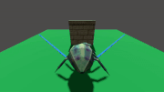

# Vision AI using Godot

## Overview

This Godot project is dedicated to creating a robust vision system that emulates entity perception within a 3D environment. Employing a combination of vision cones and raycasting, the system excels at detecting enemies or targets in dynamic game scenarios.

## Features

### 1. Vision Cone Detection

The project introduces a specialized node extension for vision cone detection. The vision cone's angle, defining the entity's field of view, is controlled by a constant parameter.

### 2. Line of Sight (LOS) using Raycasting

The LOS functionality hinges on 3D vector calculations for effective raycasting. By computing the direction vector from the entity's position to the target point, the system evaluates the existence of a clear line of sight. Importantly, the raycasting process efficiently checks for intersections with obstacles, delivering a precise assessment of visibility.

## Best Practices

To optimize computational resources, the project emphasizes prioritizing vision cone checks before engaging in raycasting. Vision cone calculations are inherently less computationally intensive compared to raycasting. Consequently, by initially examining if a point falls within the vision cone, the project minimizes reliance on resource-intensive raycast operations, focusing on potential targets within the cone.

## Implementation Details

### 3D Vector Math in LOS Function

Within the LOS function, the system begins by computing the direction vector from the entity's position to the target point. This direction vector is pivotal for gauging the existence of a clear line of sight. Subsequently, the system utilizes angular calculations to verify if the computed angle falls within the acceptable range. This dual-step process ensures a comprehensive evaluation of visibility.